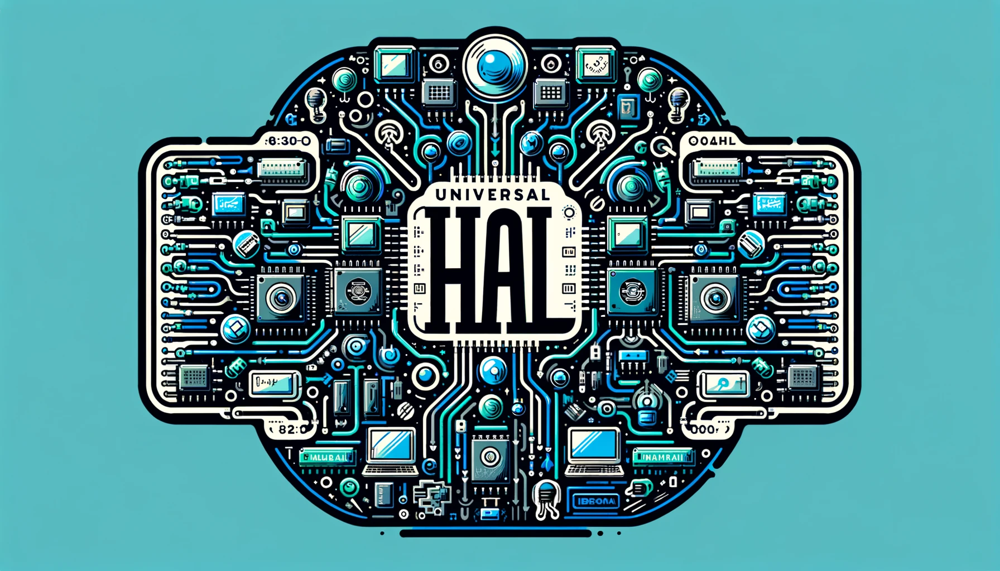

# Universal hal

The Universal hal provides a lightweight cross-platform hardware abstraction layer for 8/16/32-bit microcontrollers. Currently the following microcontrollers/platforms are supported:

| MCU               | GPIO compatibility | I2C driver compatibility |
| ----------------- | ------------------ | ------------------------ |
| Atmel SAMD21      |   **✔**            | **✔**                   |
| Atmel SAMD51      |  **✔**             | **x**                    |
| Raspberry Pi Pico |  **✔**             | **x**                    |

