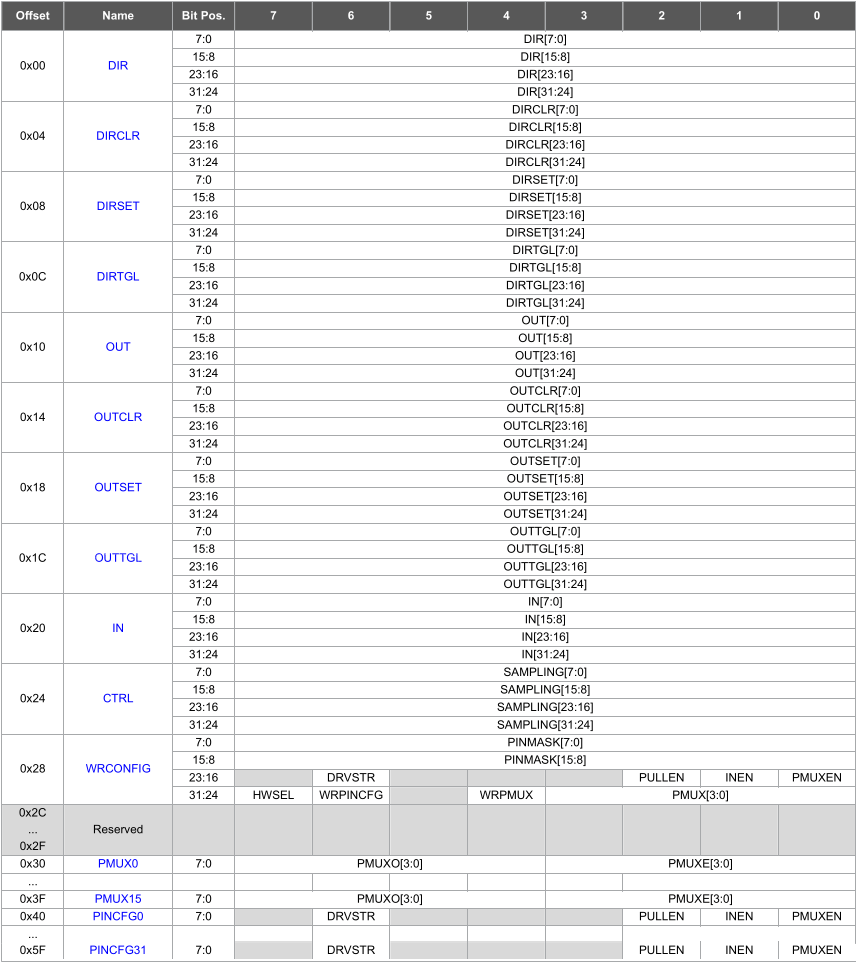
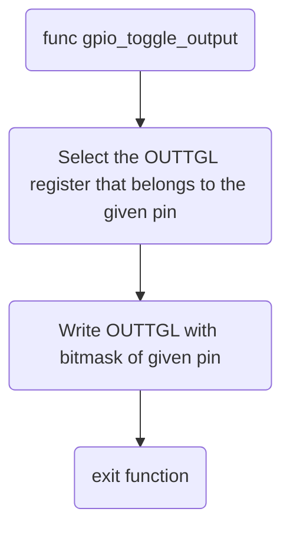

# About

The GPIO driver implementation of the SAMD series has the following compatibility:

| Function                    | Implemented | Implemented in HW or SW                                      |
| --------------------------- | ----------- | ------------------------------------------------------------ |
| gpio_toggle_pin_output()    | Yes         | HW, using the OUTTGL register                                |
| gpio_set_pin_mode()         | Yes         | HW and SW, SW translates given mode to the right HW register |
| gpio_set_pin_lvl()          | Yes         | HW, using the OUTSET register                                |
| gpio_get_pin_lvl()          | Yes         | HW, reads IN register                                        |
| gpio_get_pin_mode()         | Yes         | HW and SW                                                    |
| gpio_set_pin_options()      | Yes         | HW and SW                                                    |
| gpio_get_pin_options()      | Yes         | HW and SW                                                    |
| gpio_set_interrupt_on_pin() | Yes         | HW, uses the EIC peripheral for interrupt generation.        |

## HW and SW implementation

In the table above there is a mention of HW and SW implementation. In this context HW implementation means that the function directly calls and reads from a register. Some functions are not directly supported by some microcontrollers and have to be implemented in software or a combi of hardware and software.

One example from the table above is the `gpio_set_pin_options` function. There is no direct register translation for this function. Therefore multiple registers have to be written or read for the use of this abstract function. Thus the implementation is not entirely hardware based but also has to have software translation to select the right registers to read and write from/to. 

## Implementation details

### GPIO numbering scheme

The SAMD series uses the PORT peripheral, consisting of up to four GPIO groups, each with 32 pins. For instance, PA10 pertains to GPIO group 0, PB10 is linked with GPIO group 1, and so on. Each group is accompanied by a distinct set of registers:

??? note "Registers inside IO bank groups of the SAMD"

	

To efficiently accommodate multiple IO banks while conserving memory, a unique IO mapping strategy is used. This mapping confines everything within a 16-bit (short) space: the initial 8 bits signify the actual GPIO pin number (e.g., PA10 translates to pin number 10), while the subsequent 8 bits denote the port number.

Such a 16-bit integer mapping proves advantageous as it enables the compiler to statically assert invalid pin numbers, ensuring a robust system.

For enhanced simplicity, the Universal HAL introduces predefined pin definitions (macros). These definitions correspond to the actual pin names on the microcontroller.

**To make things easier the Universal hal comes with predefined pin definitions (macro's) which are named after the physical pins on the microcontroller.**

!!! example "Calculating the pin number"
	Imagine we want to set pin PA0, We would then end up with:
	
	0 & (1 << 8) =
	**0x100**
	
	Or PB10:
	
	10 & (2 << 8) =
	**0x20A**

### gpio_toggle_output

The `gpio_toggle_output(pin)` function toggles the gpio using the OUTTGL hardware register. TOne of these registers is the OUTTGL registers.



??? note "Code implementation" 
	
	```c
	#include <sam.h>
	
	#define SHIFT_ONE_LEFT_BY_N(N)           (1 << N)
	#define GPIO_PIN(pin) (pin & 0xFF)
	#define GPIO_PIN_GROUP(pin) ((pin >> 8) - 1)
	
	uhal_status_t gpio_toggle_pin_output(const gpio_pin_t pin) {
    /*
     * The OUTTGL register gets set with a value of (1 << pin_num).
     * This will toggle the output status of the given pin.
     * @note This might cause unwanted behavior if a pin is set as input instead of output.
     */
    PORT->Group[GPIO_PIN_GROUP(pin)].OUTTGL.reg = SHIFT_ONE_LEFT_BY_N(GPIO_PIN(pin));
    return UHAL_STATUS_OK;
	}
	```

