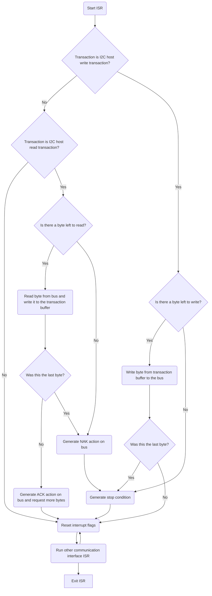

# I2C compatibility

## Platform compatibility:

The standard I2C API for this framework has basic I2C Master and I2C Slave functionality. However not every platform has I2C peripherals or supports both I2C Master and I2C Slave functionality.

| Platform   | I2C Host support    | I2C Slave support   | HW peripheral/Bitbanged |
| ---------- | ------------------- | ------------------- | ----------------------- |
| Atmel SAMD | ✔                   | ✔                   | HW peripheral           |
| RPI RP2040 | Not yet implemented | Not yet implemented | HW peripheral           |

### Atmel SAMD

The atmel SAMD series has full support for I2C Host and I2C slave functionality. The implementation is fully in hardware using the SERCOM peripherals. The implementation is purely based on interrupts, which are overridable (when using the GCC or Keil compiler). This interrupts based approach might be a concern when using very timing critical system as it is very generic and might mess with timing, unless thoroughly tested.

#### Internal implementation details

