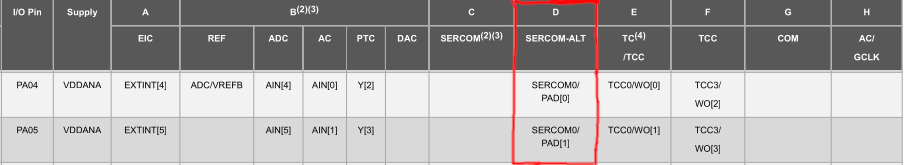

# Atmel SAMD21/51 API usage

Although the general API is the same for each microcontroller. The underlying API specifics like the linking to a clock system is very platform specific. This can not be abstracted away using simple abstractions. 

Therefore the choice was made to decouple this using a generic struct i2c_inst_t that wraps all the platform specific options in to one generic struct. This way the general API is platform independent and all platform specific options can be seperated from the integrating code. 

## Platform specific settings
To be able to use the peripheral correctly, some pins, clocks and a struct have to be set beforehand. This is the checklist for this module:

- [ ] Setup the clocks for the peripheral (skip this step when using ASF or arduino).
- [ ] Setup the pins for the peripheral (see the gpio section on this page)
- [ ] Fill-in the i2c_periph_inst_t struct with the right settings.

!!! note
	You can click on the checkmarks above to check them off your list ;)

### GPIO pinmux settings

Besides setting the i2c_inst_t struct the pins have to be linked to the hardware peripheral using the SAMD's built-in pinmux. This can be done with the gpio_set_pin_mode function:

```c
void gpio_set_pin_mode(const gpio_pin_t pin, gpio_mode_t pin_mode);
```

??? question "How to set the right pin mode?"
    For the exact pin_mode look at [Table 7-1 of the SAMD21 datasheet](https://ww1.microchip.com/downloads/aemDocuments/documents/MCU32/ProductDocuments/DataSheets/SAM-D21-DA1-Family-Data-Sheet-DS40001882H.pdf) or [Table 6-1 of  the SAMD51 datasheet](https://ww1.microchip.com/downloads/aemDocuments/documents/MCU32/ProductDocuments/DataSheets/SAM-D5x-E5x-Family-Data-Sheet-DS60001507.pdf).
     
     And **determine which column letter(s) corresponds to the right output(s)**.
     
     SERCOMx/PAD[0] corresponds to the SDA in/output of the SERCOM.
     
     SERCOMx/PAD[1] corresponds to the SCL output of the SERCOM. 
     
     For example configuring PA4 and PA5 of the SAMD21 to the SDA and SCL output of SERCOM 0:  Means that we have to set pin PA4 and PA5 to pin mode D (the column letter). The resulting function call will be:
     ```c
     {
     const gpio_pin_t SDA_PIN = {.port_num = GPIO_PORT_A, 
     							 .pin_num = 4};
     const gpio_pin_t SCL_PIN = {.port_num = GPIO_PORT_A,
     							 .pin_num = 5};
     
     gpio_set_pin_mode(SDA_PIN, GPIO_MODE_D);
     gpio_set_pin_mode(SCL_PIN, GPIO_MODE_D);
     ...
     ```

### i2c_periph_inst_t struct
The platform specific settings for the I2C host module can be found within the i2c_inst_t struct. 

```c
typedef struct {
    sercom_num_t sercom_inst_num;
    Sercom* sercom_inst;
    clk_gen_num_t clk_gen_slow;
    clk_gen_num_t clk_gen_fast;
    uint32_t fast_clk_gen_frequency;
    i2c_operating_mode_t operating_mode;
    unsigned short i2c_slave_addr;
} i2c_periph_inst_t;

```


Within this struct you will find these settings:

??? info  "sercom_inst_num -> the sercom number to couple the module to" 
  
		Example: 
  
		| Sercom     | sercom_inst_num value |
		| ---------- | --------------------- |
		| Sercom 0   | SERCOM_NUM_0          |
		| Sercom 1   | SERCOM_NUM_1          |
		| Sercom ... | SERCOM_NUM_...        |

??? info "sercom_inst -> pointer to the sercom instance."
		
		Example:
  
		| Sercom     | sercom_inst value |
		| ---------- | ----------------- |
		| Sercom 0   | SERCOM0           |
		| Sercom 1   | SERCOM1           |
		| Sercom ... | SERCOM...         |

		The pointer type uses the type and macro's used in the SAM CMSIS headers (typically included with ASF, Harmony and Arduino).
	
??? info "clk_gen_slow -> The clock generator to use for the slow clock of the Sercom."
	!!! note
		The Sercom needs two clocks to function, a slow one (< 100 KHz) and a fast one (>= $2 \cdot f_{SCL}$ ). The fast clock is used for operation in host-mode, the slow one is used for used for internal timing and synchronisation.
	
		| Clock generator     | clk_gen_slow or clk_gen_fast |
		| ------------------- | ---------------------------- |
		| Clock generator 0   | CLKGEN_0                     |
		| Clock generator 1   | CLKGEN_1                     |
		| Clock generator ... | CLKGEN_...                   |
		
		Default value: 3 -> Arduino typically has set-up a 32 KHz clock on this pin. 
		
		Other values may apply, it depends on how the clock system is laid out.

??? info "clk_gen_fast -> The clock generator to use for the fast clock of the Sercom."
 	 See the story above....

     	Default value: 0 -> Arduino has 48/120MHz main clock on this pin.

??? info "fast_clk_gen_frequency -> The output frequency of the selected clockgenerator on clk_gen_fast."
  	A typical value would be: 
  	
  		| Clock generator   | Platform | Framework | Frequency                             |
  		| ----------------- | -------- | --------- | ------------------------------------- |
  		| Clock generator 0 | SAMD51   | Arduino   | 120 MHz                               |
  		| Clock generator 0 | SAMD51   | ASF       | 8 MHz (default option in Atmel start) |
  		| Clock generator 0 | SAMD21   | Arduino   | 48 MHz                                |
  		| Clock generator 0 | SAMD21   | ASF       | 8 MHz (default option in Atmel start) |

!!! info "operating_mode -> Specifies whether the i2c host or slave driver is used."
	Use the value: `I2C_OPERATING_MODE_MASTER`

!!! warning "i2c_slave_addr -> Will not be used by the host driver"
	This sets the i2c slave address of the i2c slave driver, leave this unset or set to 0.

## Example configuration

!!! example "Adafruit Feather m0"
	This is an example configuration for a samd21g18a (adafruit feather m0)
	On the Arduino framework with the default clock settings (48 MHz).
	```c
	#ifndef F_CPU
	#define F_CPU 48000000
	#endif
	
	#define I2C_CLOCK_SPEED 100000
	
	const gpio_pin_t sda_pin = {.port_num = GPIO_PORT_A,
								.pin_num = 22};
	const gpio_pin_t scl_pin = {.port_num = GPIO_PORT_A,
								.pin_num = 23};
	
	const i2c_periph_inst_t i2c_inst0 = 
	{
	 .sercom_inst_num = SERCOM_NUM_3,
	 .sercom_inst = SERCOM3,
	 .clk_gen_slow = CLKGEN_3,
	 .clk_gen_fast = CLKGEN_0,
	 .fast_clk_gen_frequency = F_CPU,
	 .operating_mode = I2C_OPERATING_MODE_MASTER
	};
	
	void setup(){
	   gpio_set_pin_mode(sda_pin, GPIO_MODE_C);
	   gpio_set_pin_mode(scl_pin, GPIO_MODE_C);
	   i2c_init(i2c_inst0, I2C_CLOCK_SPEED);
	}
	...
	```

