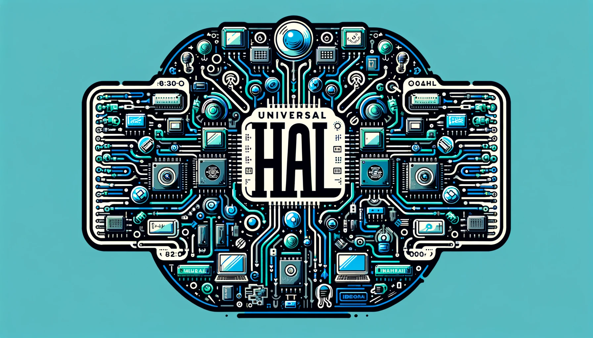

This is the documentation for the Universal hal framework. The Universal hal framework provides a generic cross platform interface to hardware peripherals/functions of microcontrollers.

There are multiple already existent software frameworks which do abstract away the hardware to a generic interface. The most well-known among these are: Arduino and Zephyr os. 

Both have their upsides and downsides. **This framework strives to achieve a middle-ground between these two frameworks**. 

## Existent frameworks

### Arduino

Arduino is one of the most well-known embedded projects in existence. It is very beginner friendly and works very well for quick prototyping.

One of the downsides with Arduino is the reliance on the BSP/HAL of the manufacturer and the messy codebase that comes with it. Also it has its own language based on c++, this of course requires a c++ compiler. Not every microcontroller manufacturer uses an architecture that supports c++.

### Zephyr os

Zephyr is an interesting project. As it provides a very lightweight (memory footprint) and efficient RTOS and hal with generic interface. 

To achieve this efficiency it uses overlay files (with custom build-system) for the hardware peripherals and connected devices. Although this approach provides good cross-platform compatibility because all hardware details are abstracted away behind a generic interface. It certainly has a steeper learning curve. Another disadvantage of zephyr is that it is targeted towards microcontrollers using a 32-bit architecture and comes with a RTOS along with it.

## Why?

The making of this framework started because of the struggles I experienced when using the START/ASF/Arduino framework on the Microchip SAMD series of microcontrollers. 

The START/ASF framework provided all the necessary functions for the project but was burdened by a convoluted codebase and demanded modifications to function smoothly on Windows without relying on Microchip Studio/MPLAB IDE (only make, no CMake support).

To mitigate this a CMake wrapper was built which used all sources and headers that were listed in the make file of the example projects. 

But then a question arose from the project client: "can this library also be used with platformio?". The answer to that question would be no, use Arduino. Regrettably, Arduino abstracted the ASF hardware abstraction layer (HAL) to a degree incompatible with the original ASF HAL. Furthermore, the Arduino framework lacked certain essential features required for our project. Zephyr OS was not even considered due to its steep learning curve and unconventional build system.

If I would wrap ASF as a platform io library, I would have problems with symbols being redefined and the whole thing not compiling without a small rebuilt of the ASF HAL. Then I would end up with what [Adafruit](https://github.com/adafruit/Adafruit_ASFcore) has done, taking the core files out of the ASF library and wrapping it into my own. However, this method posed its own set of risks, especially if the manufacturer released a new version of the ASF library, potentially causing API breaks and resulting in a cluttered codebase.

> "A complex system that works is invariably found to have evolved from a simple system that worked. A complex system designed from scratch never works and cannot be patched up to make it work. You have to start over with a working simple system." ~ John Gall

Instead I chose to do the thing every insane person would do :) Creating my own HAL and abstractions. The goal was to make the drivers compatible with as many microcontroller architectures as possible, all while minimizing performance overhead and ensuring compatibility with a wide range of toolchains and IDEs.

## Design philosophy

Someone mentioned that I should add my design philosophy to the documentation.  Perhaps it's more appropriate to clarify the primary objective of this framework: "To provide a streamlined, lightweight hardware abstraction layer written in C that offers users the flexibility to easily augment it with custom drivers and implementations."

Keen observers may have already noticed that achieving this objective entirely can be challenging. Striving for complete cross-platform compatibility necessitates the construction of a complex infrastructure around the framework, thus compromising its simplicity.

On the other hand, if we opt for a simpler system, it would require introducing numerous abstractions. These abstractions, especially on embedded systems, incur performance overhead. Additionally, an abundance of abstractions reduces configurability (since most options are abstracted away in the mess of abstraction layers).

The best way to reach the objective is by finding a balance in the amount of abstractions and the functions the framework has to offer. With the primary focus on hardware compatibility and performance. 

These are some decisions I have made regarding above mentioned points:

- Let the build-system (PIO/CMake) manage the to be included source and header files. The build-system automatically detects which platform is compiled for and includes the right files in to the build process.

- Create generic functions that every hal has in some form or another.  If the platform doesn't have the hardware functionality, replace it with software if applicable. If it can not be replaced in software, replace it with warnings or errors. The implementation of the function is handled in platform specific source files.

- Let the compiler do the work, not the MCU. 

- Allocate everything statically. I try to minimize the use of the HEAP (if the mcu even has a HEAP to begin with :/ )

- Everything uses the c language. Why? For compatibility sake, c can be compiled on almost all microcontrollers.

- Functions that might require a custom implementation are weakly linked using the weak attribute:
  
  ```
  __attribute__((weak));
  ```
  
  This way the compiler automatically takes a custom implementation over the function defined in the library itself. 

- Hardware specific things like handles and clock sources are abstracted away in to handles (structs).

These are some of my decisions as of now, I am very open to feedback or suggestions on improving the library/code style.

## Contributing

See the contributing tab in the navigation bar to your left.

If contributing I generally recommend following these principles:

- KISS Principle:
  
  "Keep It Simple Stupid"

- Loose Coupling (But don't over-exaggerate):
  
  "Components are weakly associated (have breakable relationships) with each other, and thus changes in one component least affect existence or performance of another component."

- DRY:
  
  "Don't repeat yourself"

- Fail-fast:
  
  "A **fail-fast** system is one which immediately reports at its interface any condition that is likely to indicate a failure."

- Minimalism:
  
  "**Minimalism** refers to the application of [minimalist](https://en.wikipedia.org/wiki/Minimalist "Minimalist") philosophies and principles in the design and use of hardware and software. Minimalism, in this sense, means designing systems that use the least hardware and software resources possible."
